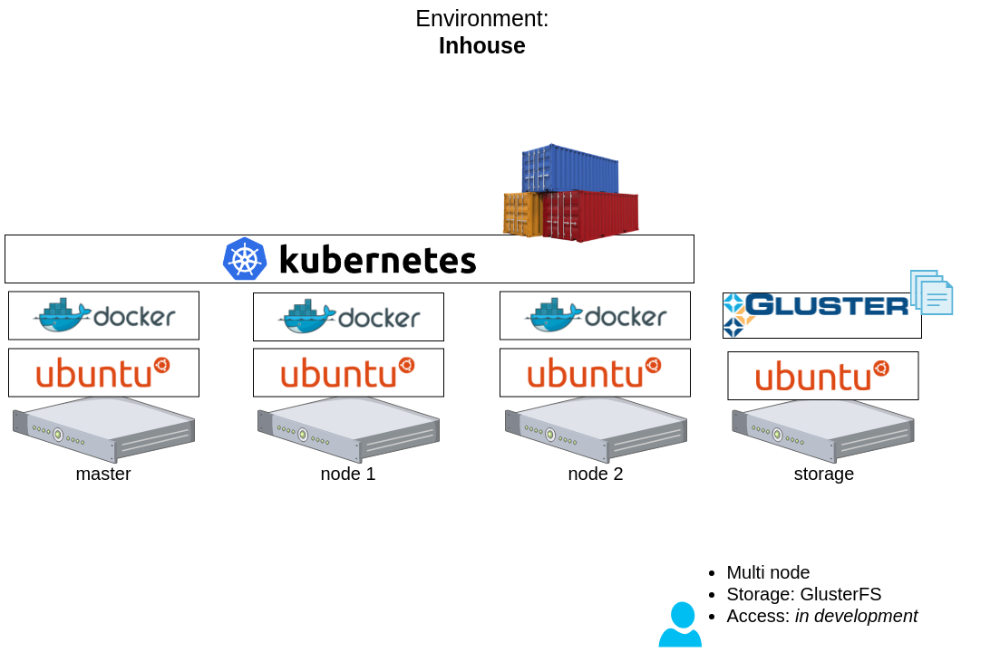

# Simple Kubernetes  example (cont.)

[back](./README.md)

## PART II: Deploy Nginx with storage

### 1. Deploy Nginx with a local volume
(Best option for development environments)


#### 1.1. Run Kubernetes on Minikube

* Install Minikube: https://kubernetes.io/docs/setup/minikube/

> Minikube settings:
> Global: `cat ~/.minikube/config/config.json`
> , Local: `cat ~/.minikube/machines/minikube/config.json`
> , Command: `minikube config [set|get] --help`

#### 1.2. Setup Minikube driver

* VirtualBox

1. Install VirtualBox + VirtualBox VM VirtualBox Extension Pack: https://www.virtualbox.org/wiki/Downloads
2. Set default driver: `minikube config set vm-driver virtualbox`

* KVM2

1. Install KVM2: https://github.com/kubernetes/minikube/blob/master/docs/drivers.md#kvm2-driver
2. Set default driver: `minikube config set vm-driver kvm2`

#### 1.3. Deploy test environment: Local volume

(from: https://kubernetes.io/docs/tasks/configure-pod-container/configure-persistent-volume-storage/)

* Create environment: Start MiniKube, mount folder & apply k8s scripts

```shell
make localv_up
```

* View results

```shell
make localv_results
```

> Output: This is a HOSTPATH test

* Destroy environment

```shell
make localv_down
```

* Official documentation
    * https://kubernetes.io/docs/setup/minikube/#persistent-volumes
    * https://kubernetes.io/docs/tasks/configure-pod-container/configure-persistent-volume-storage/


### 2. Deploy Nginx with a GlusterFS volume



* Create environment: Start Vagrant instances, provision K8s, provision GlusterFS, deploy Nginx pod

```shell
make glusterv_up
```

* View results

```shell
vagrant ssh k8sMaster
    $ curl http://192.168.32.12:$(kubectl get svc mynginx -o json | jq -j '.spec.ports[0].nodePort')
```

> Output: This is a GLUSTERFS test

* Destroy environment

```shell
make glusterv_down
```

* Official documentation
    * https://docs.gluster.org/en/v3/CLI-Reference/cli-main/
    * https://docs.openshift.com/container-platform/3.9/install_config/storage_examples/gluster_example.html

#### Dependencies

* [Exposing services](./exposing-services): Expose an application outside a Kubernetes cluster using a Service

### 3. Deploy Nginx with a Google Compute Engine (GCE) Persistent Disk volume !!EXPERIMENTAL!!
(TODO)


* Commands

```shell
make gcev_apply
```

* Official documentation
    * https://cloud.google.com/kubernetes-engine/docs/tutorials/persistent-disk
    * https://github.com/GoogleCloudPlatform/kubernetes-engine-samples
    * https://kubernetes.io/docs/concepts/storage/volumes/#gcepersistentdisk
    * https://kubernetes.io/docs/concepts/storage/storage-classes/
    * https://cloud.google.com/compute/docs/disks/#performance
    * https://cloud.google.com/compute/docs/disks/add-persistent-disk#formatting

[back](./README.md)
